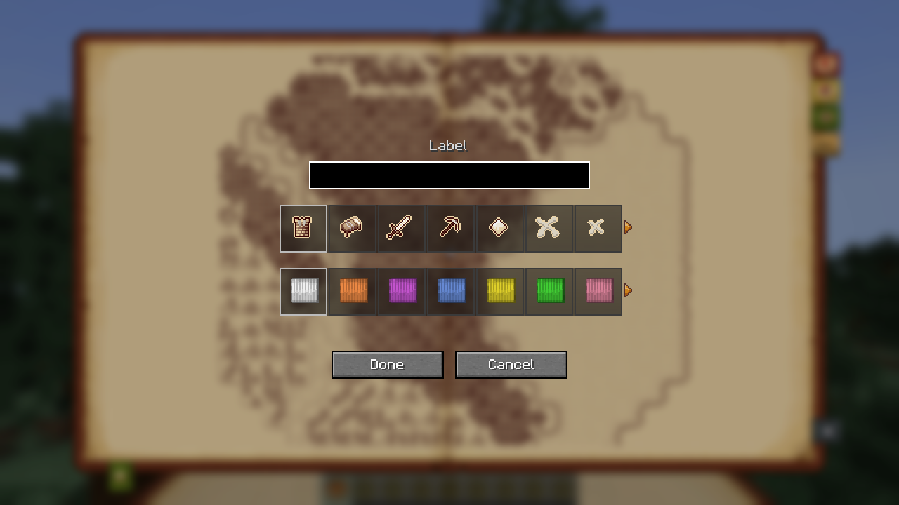
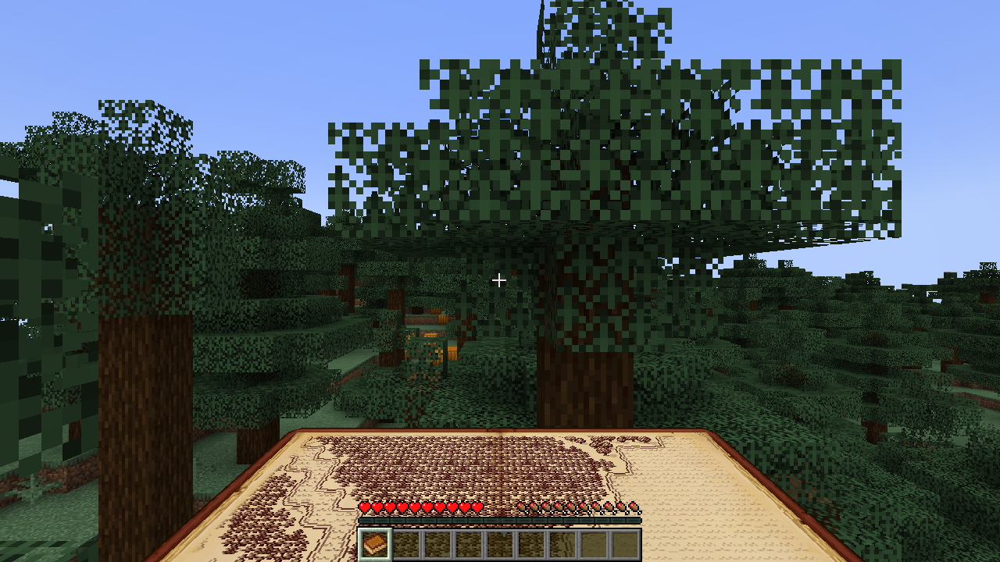

# Using the Atlas

## Opening it

- Press **M** (change it under Controls → Antique Atlas → Open Atlas).
- Or right-click while holding an atlas book (see below).

The map shows only what you have explored. Chunks appear as you see them; structures once you have stood in them or looked at them.

## Moving around

- **Drag** with the mouse to move the map.
- **Scroll** to zoom in and out.
- The arrow button (bottom right) centres the map on you again.
- The icons at the bottom left switch between the dimensions you have explored.

## The bookmarks

On the right edge of the book:

| Bookmark | What it does |
|---|---|
| **Add marker** | Click it, then click on the map: choose an icon, a colour and a label, then **Done**. |
| **Delete marker** | Click it, then click one of your markers to remove it. |
| **Hide / show markers** | Clear the map of markers, or bring them back. |
| **Scale** | Shows how many chunks one tile covers; click to reset the zoom. |

On the left edge is the list of your markers: click one to jump to it.

## The atlas in your hands

An atlas is a **book named `Antique Atlas`**: rename a book at an anvil, or take one from the Tools & Utilities creative tab.

- Hold it to see the map around you, like a vanilla map — with both hands when your other hand is empty.
- Right-click it to open the full atlas.

With `requireItem = true` in the [configuration](Configuration), the **M** key only works while you carry an atlas.
